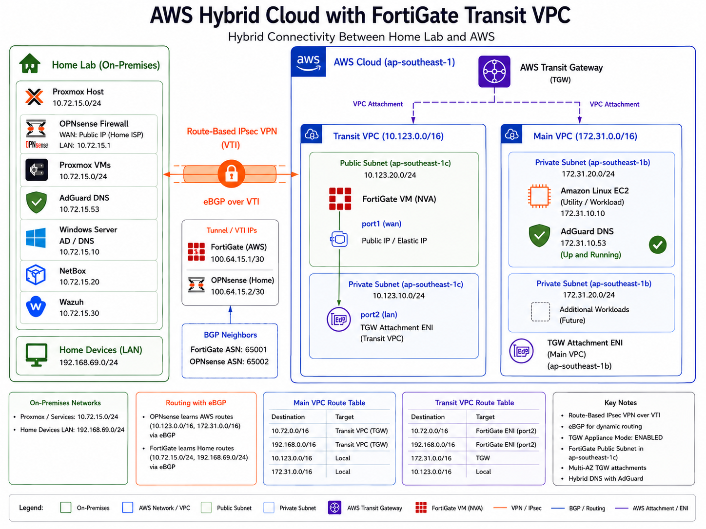

# AWS Hybrid Cloud with Transit VPC & FortiGate

> Enterprise-style hybrid cloud architecture connecting an on-premises homelab to AWS using a dedicated Transit VPC, FortiGate Network Virtual Appliance (NVA), AWS Transit Gateway, and dynamic routing over IPsec.



---

# Overview

This project demonstrates an enterprise hybrid-cloud design rather than a simple site-to-site VPN.

Instead of terminating the VPN directly into an application VPC using AWS Managed VPN, a **Transit VPC** was built to act as the network services layer. A FortiGate firewall running inside AWS functions as the Network Virtual Appliance (NVA), providing centralized routing and security while AWS Transit Gateway distributes connectivity to application VPCs.

The initial workload deployed in AWS is an **AdGuard DNS server**, providing a secondary DNS service for the on-premises environment. However, the architecture is intentionally designed to support multiple application VPCs without redesigning the network.

---

# Architecture

```
               Home Lab
                   │
                   │
          Route-Based IPsec VPN
              eBGP over VTI
                   │
                   ▼
        ┌─────────────────────┐
        │     Transit VPC     │
        │                     │
        │  FortiGate VM (NVA) │
        └─────────┬───────────┘
                  │
          AWS Transit Gateway
                  │
      ┌───────────┴───────────┐
      │                       │
 Main VPC               Future VPCs
      │
      ▼
 Amazon Linux
 AdGuard DNS
```

---

# Technologies Used

| Category | Technology |
|-----------|------------|
| Cloud | AWS |
| Firewall | FortiGate VM |
| Transit | AWS Transit Gateway |
| VPN | Route-Based IPsec (VTI) |
| Routing | eBGP |
| Hypervisor | Proxmox |
| On-prem Firewall | OPNsense |
| DNS | AdGuard Home |
| Compute | Amazon Linux 2023 |
| Networking | VPC, Subnets, Route Tables, ENIs |

---

# Network Layout

## Home Lab

| Network | Purpose |
|----------|----------|
| 10.72.15.0/24 | Servers & Infrastructure |
| 192.168.69.0/24 | Home Client Devices |

---

## AWS Transit VPC

| Network | Purpose |
|----------|----------|
| 10.123.0.0/16 | Network Services |
| 10.123.20.0/24 | Public Subnet |
| 10.123.10.0/24 | Private Subnet |
| FortiGate | Network Virtual Appliance |

---

## Main Application VPC

| Network | Purpose |
|----------|----------|
| 172.31.0.0/16 | Workloads |
| Amazon Linux | Utility Server |
| AdGuard | Secondary DNS |

---

# Dynamic Routing

Instead of using static routes, routing is exchanged dynamically through **eBGP**.

### BGP Neighbors

| Device | ASN |
|----------|-----|
| FortiGate | 65001 |
| OPNsense | 65002 |

---

### Learned Routes

**AWS learns**

- 10.72.15.0/24
- 192.168.69.0/24

**On-Premises learns**

- 172.31.0.0/16
- 10.123.0.0/16

No manual route updates are required when advertised prefixes change.

# On-premise OPNSENSE Firewall - Edge GW going to AWS


# AWS Fortigate NVA in transit VPC


# Why a Transit VPC?

A common lab setup connects an AWS Site-to-Site VPN directly into an application VPC.

While functional, this design does not scale well.

This project intentionally separates **network infrastructure** from **application infrastructure**, following patterns commonly found in enterprise environments.

## Advantages

### Separation of Duties

The Transit VPC acts as a dedicated network services layer.

Application workloads remain isolated from VPN termination and routing infrastructure.

---

### Centralized Security

All hybrid traffic traverses the FortiGate firewall.

This enables:

- Security policy enforcement
- Logging
- Inspection
- Future IPS/IDS deployment
- NAT policies if required

---

### Scalability

Future VPCs simply attach to the Transit Gateway.

No additional VPN tunnels are required.

Example:

```
                 Transit Gateway

        ┌──────────┼──────────┐

   Main VPC    Dev VPC    Production VPC

        │           │             │

        └──────── FortiGate ──────┘
```

The same VPN can securely provide connectivity to every attached VPC.

---

### Enterprise Design Pattern

Large organizations commonly deploy dedicated network hubs rather than terminating VPNs directly into workload VPCs.

This design closely mirrors architectures used in:

- Enterprise AWS environments
- Managed Service Providers
- Financial institutions
- Multi-account AWS Organizations
- Shared Services VPC deployments

---

# Why Not Native AWS Site-to-Site VPN?

Native AWS VPN is an excellent service, but it provides limited control over traffic inspection and advanced routing compared to a firewall-based design.

This project intentionally uses a FortiGate NVA to gain:

- Stateful firewall policies
- Future IPS capabilities
- Full routing control
- Traffic visibility
- Centralized security services
- Vendor-neutral firewall experience

This approach also reflects how many enterprise environments integrate third-party firewalls into AWS.

---

# Primary Use Case

The first production workload hosted in AWS is an **AdGuard Home** DNS server.

Purpose:

- Secondary DNS resolver
- Redundant DNS service
- Hybrid name resolution
- Secure access from the on-premises network

Because the VPN uses dynamic routing, the DNS server is reachable without additional static routes.

---

# Current Features

- Dedicated Transit VPC
- AWS Transit Gateway
- FortiGate VM (NVA)
- Route-Based IPsec VPN (VTI)
- eBGP Dynamic Routing
- Amazon Linux Utility Server
- AdGuard Home
- Separate Transit and Application VPCs
- Hybrid DNS
- Enterprise-style network segmentation

---

# Future Enhancements

- Multi-AZ FortiGate High Availability
- Additional Application VPCs
- AWS Inspection VPC
- AWS Network Firewall comparison
- Wazuh SIEM integration
- AWS Systems Manager
- Private Hosted Zones
- Route53 Resolver Endpoints
- AWS Client VPN
- Terraform deployment
- CI/CD with GitHub Actions

---

# Lessons Learned

This project reinforced several enterprise networking concepts:

- AWS Transit Gateway architecture
- Network Virtual Appliances (NVAs)
- Transit VPC design
- Route-Based VPNs
- eBGP route advertisement
- AWS route table design
- Hybrid DNS architecture
- Cloud network segmentation
- Enterprise hub-and-spoke networking
- Designing for scalability instead of immediate requirements

---

# Repository Structure

```
.
├── README.md
├── Enterprise_Hybrid_Cloud.png
├── diagrams/
├── screenshots/
│   ├── fortigate/
│   ├── aws/
│   ├── opnsense/
│   └── adguard/
└── docs/
    ├── bgp.md
    ├── transit-gateway.md
    ├── vpn.md
    └── routing.md
```

---

# Author

**Sid Laxamana**

Cloud Infrastructure • Network Engineering • AWS • Fortinet • Cisco

Building enterprise-inspired cloud networking labs to deepen expertise in hybrid cloud architecture, security, and automation.
